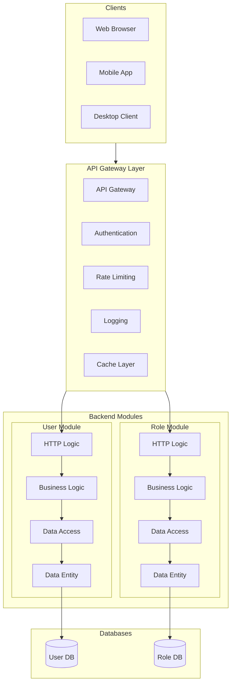
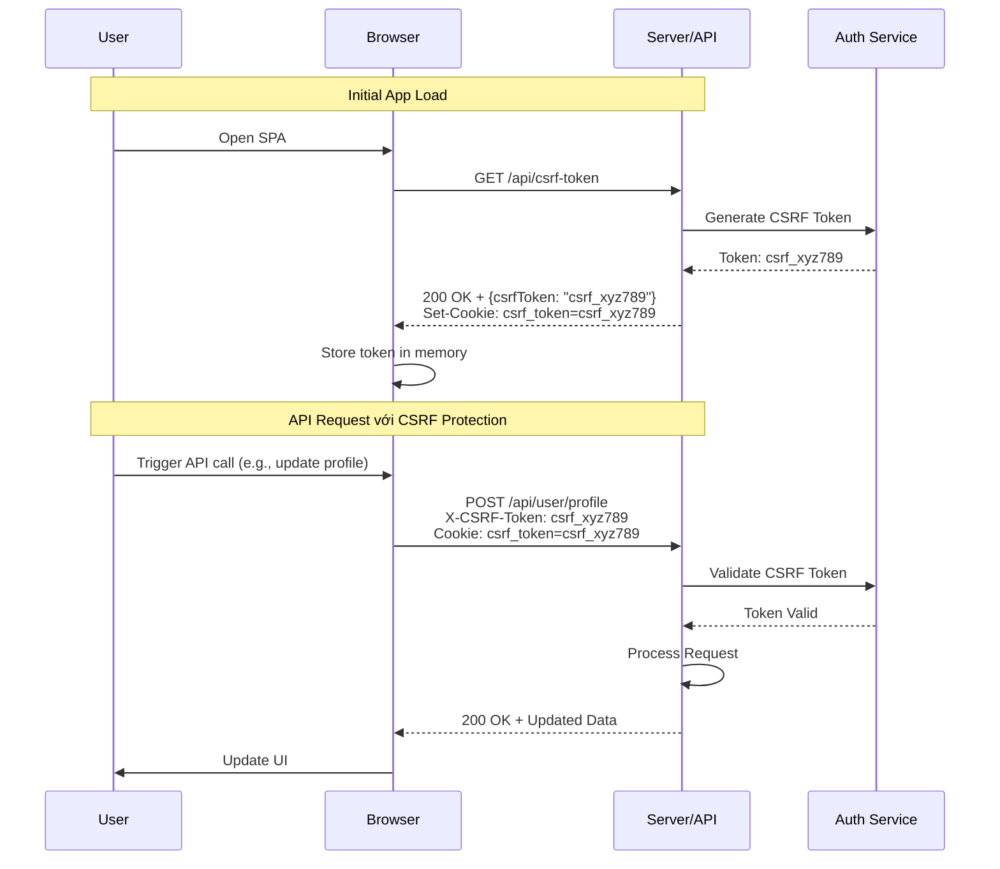
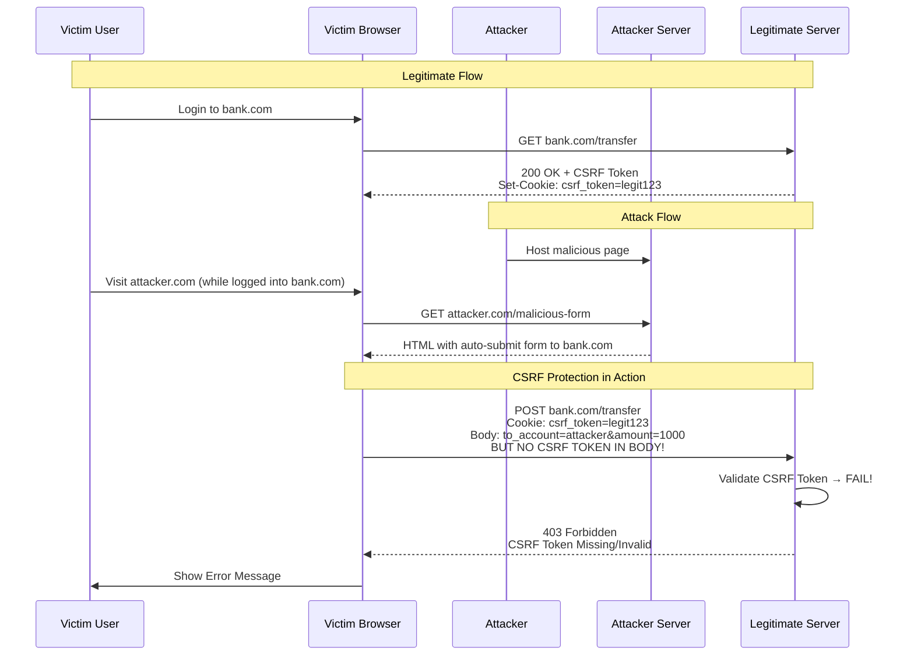
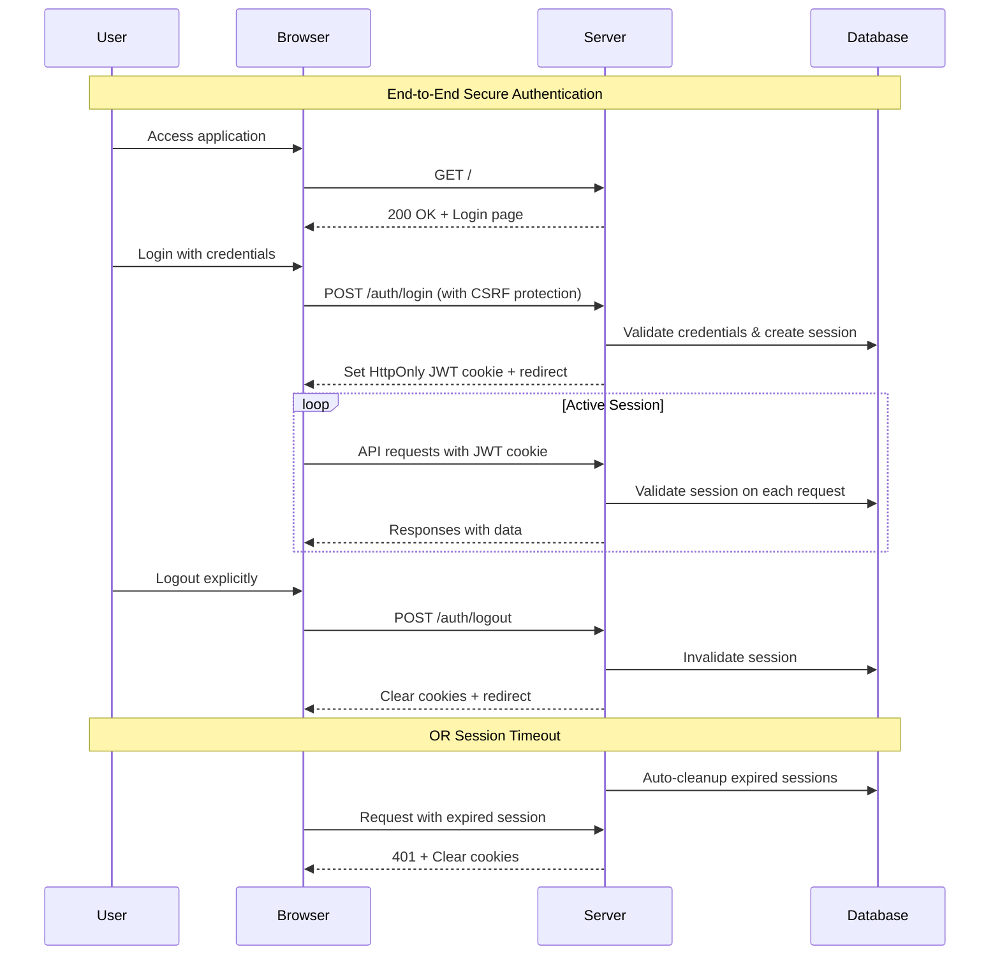
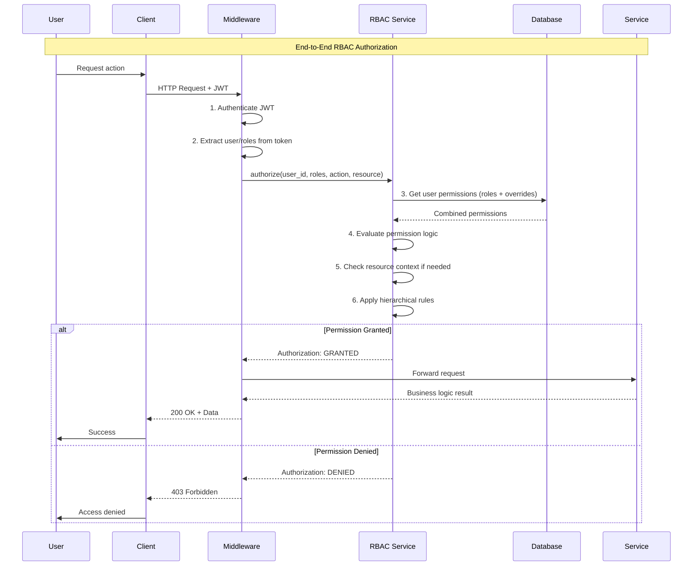
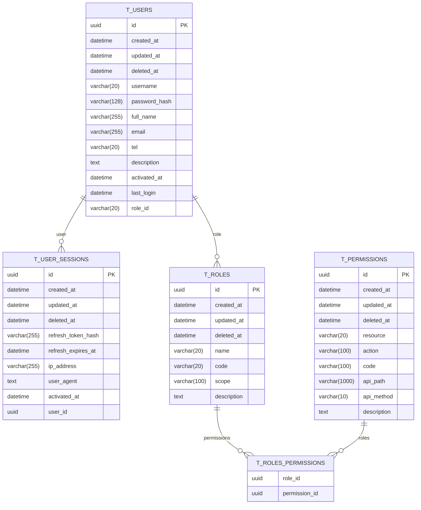

# Architecture Design

## System Architecture Overview

FastAPI Backend It adopts a classic three-tier architecture design to ensure the maintainability, scalability and testability of the code.



## Core design principles

### 1. Single Responsibility Principle

Each level has clear responsibilities to avoid confusion of responsibilities:

- **Controller Layer**: Handling HTTP requests and responses
- **Service Layer**: Implementing business logic
- **Repository Layer**: Data access and persistence
- **Entity Layer**: Data structure definition

### 2. Dependency Inversion Principle

High-level modules do not depend on low-level modules and are decoupled through interfaces:

```python
# The Service layer relies on the Repository abstraction
class UserService:
    def __init__(self, user_repo: UserRepository):
        self.user_repo = user_repo
```

### 3. Open/Closed Principle

Open for extension, closed for modification:

```python
# Extending functionality through inheritance
class EnhancedUserService(UserService):
    def create_user_with_notification(self, user_data):
        user = super().create_user(user_data)
        self.send_notification(user)
        return user
```

## Detailed explanation of hierarchical architecture

### Controller layer (src/module/[name]/controller)

Responsible for processing HTTP requests and responses, including:

- **Route Definition**: Defining API endpoints
- **Request Verification**: Validating input parameters
- **Response Formatting**: Unified response format
- **Exception handling**: Unified error handling

```python
@router.post("/users", response_model=UserResponse)
async def create_user(user_data: UserCreate):
    """Create a user API endpoint"""
    return await user_service.create_user(user_data)
```

### Service layer (src/module/[name]/service/)

Contains core business logic, including:

- **Business Rules**: Implementing business logic
- **Permission Verification**: Check User Permissions
- **Transaction Management**: Coordinating multiple operations
- **Cache Management**: Data caching strategy

```python
class UserService:
    async def create_user(self, user_data: UserCreate):
        # Business logic verification
        if await self.user_repo.exists(email=user_data.email):
            raise ValueError("Email already exists")

        # Password encryption
        user_data.password = hash_password(user_data.password)

        # Create a User
        return await self.user_repo.create(user_data)
```

### Repository Layer (src/module/[name]/repository/)

Responsible for data access, including:

- **CRUD operations**: Basic data operations
- **Query Building**: Complex query building
- **Data Mapping**: Model and DTO conversion
- **Transaction Control**: Database transaction management

```python
class UserRepository:
    async def create(self, user_data: UserCreate) -> User:
        return await User.create(**user_data.dict())

    async def get_by_id(self, user_id: int) -> Optional[User]:
        return await User.get_or_none(id=user_id)
```

### Entity layer (src/module/[name]/entity/)

Define the data structure, including:

- **Data Model**: Tortoise ORM Model
- **Relationship Definition**: Configuration of relationships between tables
- **Index Configuration**: Database index
- **Constraint Definition**: Data constraints

```python
class User(EntityBase, TimestampMixin):
    id = fields.IntField(pk=True)
    username = fields.CharField(max_length=50, unique=True)
    email = fields.CharField(max_length=100, unique=True)

    # Relationship Definition
    roles = fields.ManyToManyField("models.Role", related_name="users")
```

## Core Components

### 1. CSRF protection

CSRF Token in SPA (Single Page Application) mechanism:



CSRF Attack Prevention mechanism:



### 2. Authentication system

JWT-based authentication mechanism:



### 3. Permission Control

RBAC-based permission mechanism:



### 4. Database design

Use Tortoise ORM to implement data persistence:



## Design Patterns

### 1. Dependency Injection

Using FastAPI's dependency injection system:

```python
# Dependency Definition
def get_user_service() -> UserService:
    return UserService(user_repository)

# Using Dependencies
@router.post("/users")
async def create_user(
    user_data: UserCreate,
    user_service: UserService = Depends(get_user_service)
):
    return await user_service.create_user(user_data)
```

### 2. Warehousing model

Encapsulate data access logic:

```python
class BaseRepository:
    def __init__(self, model: Type[Model]):
        self.model = model

    async def create(self, data: dict) -> Model:
        return await self.model.create(**data)

    async def get_by_id(self, id: int) -> Optional[Model]:
        return await self.model.get_or_none(id=id)
```

### 3. Service layer model

Encapsulate business logic:

```python
class BaseService:
    def __init__(self, repository: BaseRepository):
        self.repository = repository

    async def create(self, data: BaseModel) -> Model:
        # Business logic processing
        validated_data = self.validate_data(data)
        return await self.repository.create(validated_data)
```

## Extension Guide

### Add new functional modules

1. **Create the model** (src/models/):

```python
class Product(EntityBase, TimestampMixin):
    name = fields.CharField(max_length=100)
    price = fields.DecimalField(max_digits=10, decimal_places=2)
```

2. **Create a repository** (src/repositories/):

```python
class ProductRepository(BaseRepository):
    def __init__(self):
        super().__init__(Product)
```

3. **Creating a Service** (src/services/):

```python
class ProductService(BaseService):
    def __init__(self, product_repo: ProductRepository):
        super().__init__(product_repo)
```

4. **Creating an API** (src/api/v1/):

```python
@router.post("/products")
async def create_product(
    product_data: ProductCreate,
    product_service: ProductService = Depends(get_product_service)
):
    return await product_service.create(product_data)
```

### Custom middleware

```python
@app.middleware("http")
async def custom_middleware(request: Request, call_next):
    # Before processing the request
    response = await call_next(request)
    # After processing the response
    return response
```

## Performance optimization

### 1. Database optimization

- Eagerly loading related data using `select_related()`
- Optimizing many-to-many queries with `prefetch_related()`
- Add appropriate database indexes

### 2. Caching strategy

- Use Redis to cache frequently queried data
- Implement query result caching
- Set a reasonable cache expiration time

### 3. Asynchronous processing

- Using asynchronous I/O operations
- Reasonable use of connection pool
- Avoid blocking operations

## Summarize

This architectural design provides:

- ✅ **Clear hierarchy**
- ✅ **High testability**
- ✅ **Good scalability**
- ✅ **Strong type safety**
- ✅ **Complete error handling**

By following these design principles and patterns, you can build stable, efficient, and easy-to-maintain enterprise-level applications.
